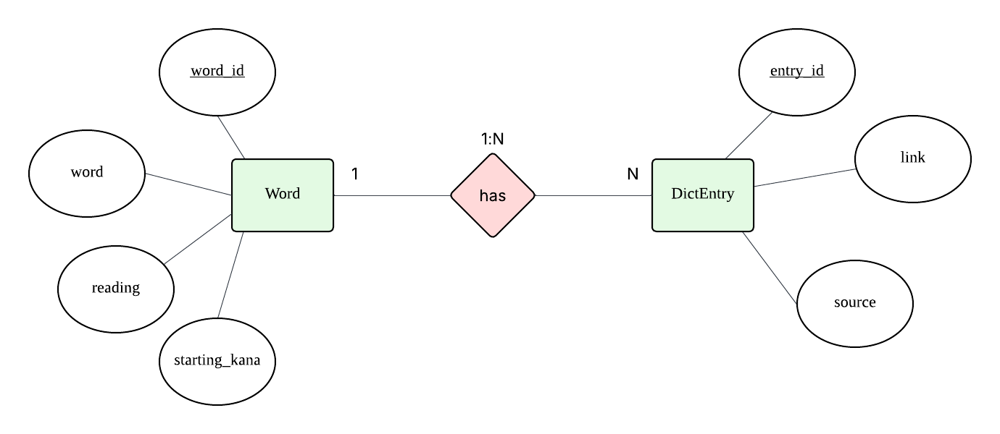
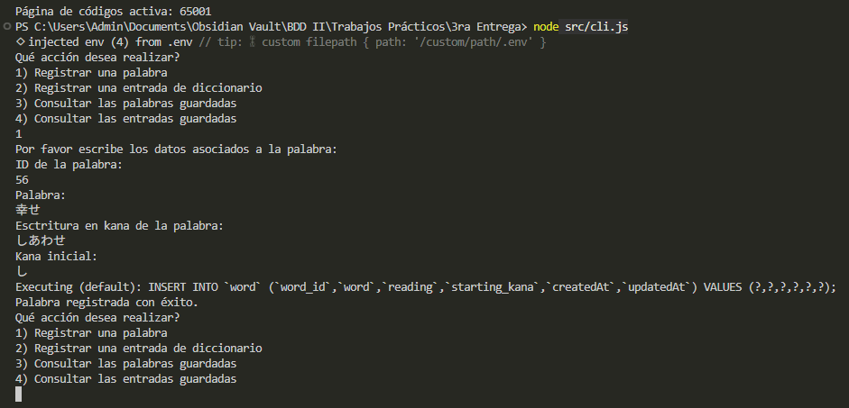
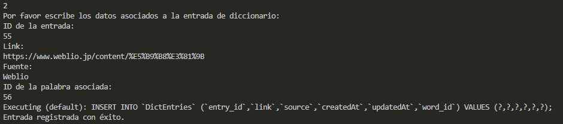
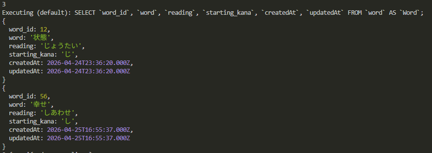
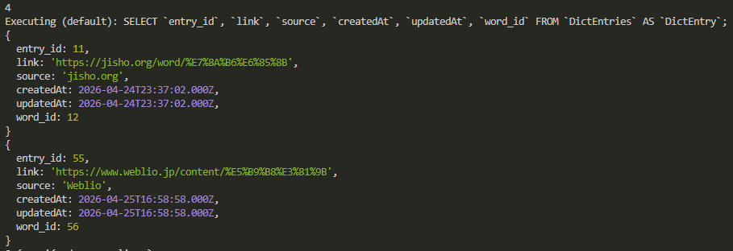

### Proyecto Implementación de ORM

Opté para este proyecto modelar una base de datos en dónde se guardan palabras del idioma japonés y definiciones de distintos diccionarios
de diversas fuentes provenientes de la web. Usé para realizarlo el lenguaje de programación JavaScript, el framework ORM Sequelize y el SW gestor de BDD MySQL.

> Comienzo por mostrar el DER representativo del sistema, en dónde las entidades presentan una relación de uno a muchos acorde a lo que corresponde:



- Una palabra tiene muchas entradas de distintos diccionarios, y cada entrada corresponde a una única palabra.

Comencé por crear la BDD utilizando la GUI de MySQL, ejecutando la siguiente instrucción como el usuario root desde el servicio localhost:

`CREATE DATABASE japanese_definitions;`

A partir de esto, creé clases que modelan las tablas que se mapearán al SGBD mediante el ORM, permitiendo almacenar y gestionar los datos de la aplicación.

El código que habilita esto se encuentra dentro del directorio /models que a su vez está dentro del directorio /src, que contiene el código fuente principal de la aplicación.

```
PROYECTO_DEFINICIONES/
│
├── .vscode/
├── node_modules/
├── src/
│   ├── config/
│   │   └── database.js
│   │
│   ├── models/     <--- ACÁ
│   │   ├── dict_entry_model.js
│   │   ├── index.js
│   │   └── word_model.js
│   │
│   ├── services/
│   │   ├── dict_entry_service.js
│   │   └── word_service.js
│   │
│   ├── cli.js
│   └── server.js
│
├── .env
├── .gitignore
├── package-lock.json
├── package.json
└── README.md
```

> Por convención práctica dentro del desarrollo de proyectos que implementan ORM en Node.js, modelo la relación entre las dos tablas en el script "index.js" y no dentro de los scripts "word_model.js" y "dict_entry_model.js" en sí. La división de responsabilidades entre los scripts que modelan tablas e "index.js" permite que el código sea más claro.

```
// index.js
const sequelize = require("../config/database");
const Word = require("./word_model.js");
const DictEntry = require("./dict_entry_model.js");

const db = {
	sequelize,
	Word,
	DictEntry,
};

// Asociación
db.DictEntry.belongsTo(db.Word, {
	foreignKey: "word_id",
});

db.Word.hasMany(db.DictEntry, {
	foreignKey: "word_id",
});

module.exports = db;
```

**_En cuanto a los demás scripts que se pueden apreciar dentro del directorio src/:_**

- config/database.js: Acá se instancia en un objeto la clase Sequelize, que representa una interfaz a través de la cual interactuar con la BDD desde nuestro código. Ejecuta queries, gestiona la conexión y "traduce" las operaciones ORM a SQL. Desde este módulo, exportamos el objeto creado para que otros módulos del proyecto puedan llamar a métodos asociados a él.

- services/: Acá residen las funciones que habilitan la creación y consulta de datos desde la aplicación. Si bien no interactúan con el objeto "sequelize", son fundamentales como "puente" entre la aplicación/usuario y el sistema gestor de BDD. Usan metodos de las clases de los modelos creados para interactuar con las tablas de la BDD.

- cli.js: Define la lógica asociada a la interfaz que ve el usuario, captura los datos provistos por este y consume una API a través de la cual llama a los métodos pertinentes a los modelos definidos y así interactua con el servidor de BDD.

- server.js: Transforma la aplicación en un servicio persistente que puede ser accedido a través de la aplicación.

Pruebo insertar una palabra con ID:



Luego, insertar una entrada de diccionario:



Luego de realizar las inserciones, puedo consultar tanto el registro de la palabra como el registro de la entrada de diccionario:




